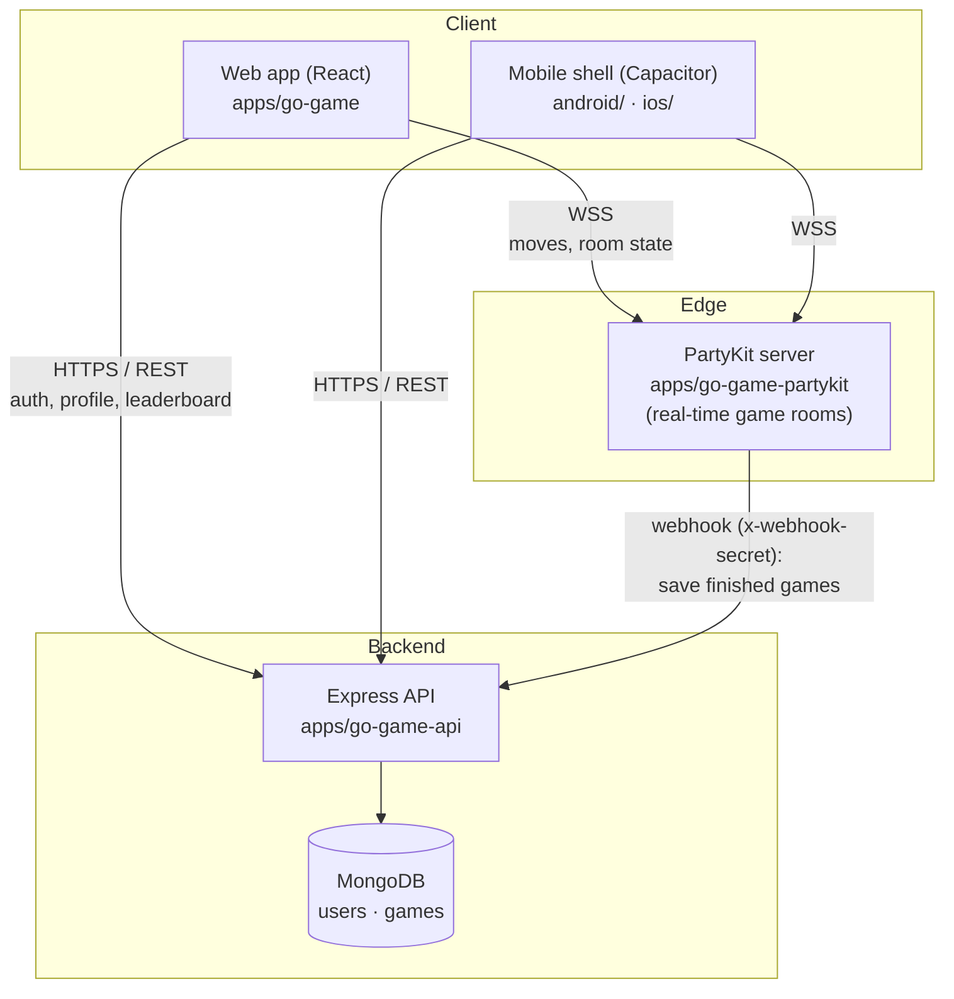
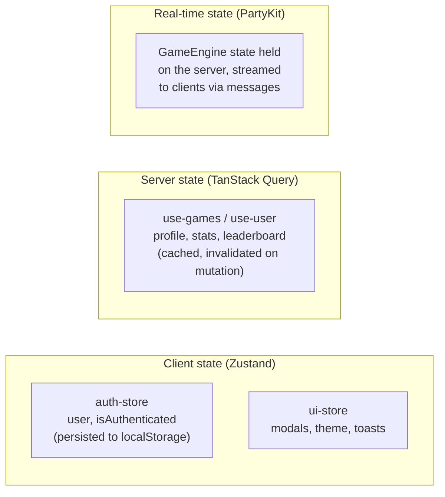
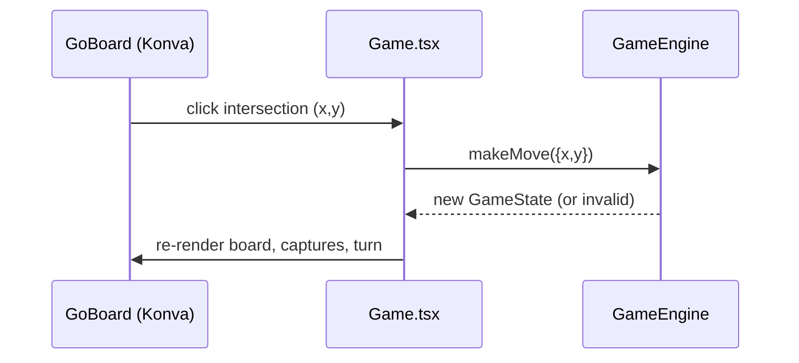
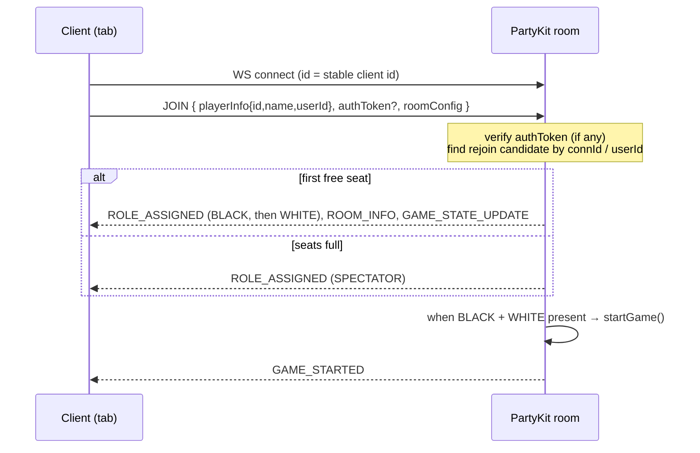
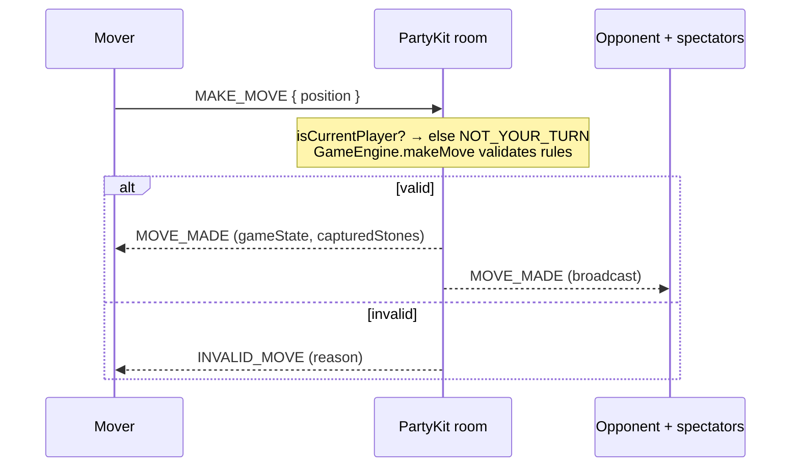
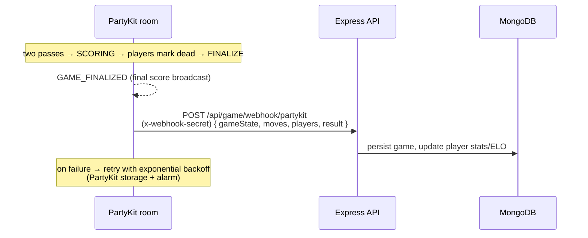
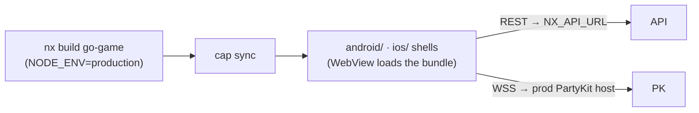

# Architecture & App Flows

A whole-system map of the Go Game project: what the pieces are, how they fit
together, and how data moves through the key flows. Grounded in the actual code
(file paths are clickable references).

> Companion docs: [`README.md`](README.md) (quick start),
> [`SPEC.md`](SPEC.md) (product direction & considerations),
> [`MULTIPLAYER_GUIDE.md`](MULTIPLAYER_GUIDE.md) (multiplayer feature detail),
> [`PRODUCTION_READINESS.md`](PRODUCTION_READINESS.md) (deploy roadmap).
> Note: `docs/ui-architecture.md` is an early planning doc and does **not**
> reflect the current structure — prefer this file.

---

## 1. System topology

Four deployable surfaces around one shared game engine.



Key idea: **real-time gameplay runs entirely through PartyKit and does not
require the API or the database.** The API/Mongo provide auth, profiles, stats,
leaderboard, and *persistence of finished games*. You can play multiplayer fully
logged-out with only PartyKit running.

---

## 2. Monorepo layout (Nx)

```
apps/
  go-game/            React frontend (RSpack, Mantine, Konva)
  go-game-api/        Express + Mongoose REST API (esbuild, bundle:false)
  go-game-partykit/   PartyKit WebSocket server (authoritative game rooms)
  go-game-e2e/        Playwright E2E (frontend)
  go-game-api-e2e/    API E2E (Jest/axios)
libs/
  game/               Game engine + React components + services + stores
    src/lib/
      game.ts                 GameEngine (rules orchestration)
      scoring.ts              territory / dead-stone scoring
      components/             GoBoard, Game, MultiplayerGame, controls…
      services/               api-client.ts, partykit-client.ts
      stores/                 auth-store.ts, ui-store.ts (Zustand)
      hooks/                  use-games.ts, use-user.ts (TanStack Query)
  shared/             Cross-cutting, framework-free
    types/            GameState, Move, Position, Player…
    constants/        board sizes, defaults
    utils/            pure helpers (groups, liberties, ko, suicide)
    partykit-protocol/  client⇄server message contract (enums + unions)
  ui/                 Reusable UI + Mantine theme
docker/               api/Dockerfile, docker-compose.yml, mongodb/init
```

Module boundaries are enforced by ESLint (`@nx/enforce-module-boundaries`):
apps depend on libs, libs depend on lower libs, never upward.

---

## 3. Tech stack

| Concern | Choice |
|---|---|
| UI framework | React 19 + Mantine 8 |
| Board rendering | Konva / react-konva (canvas) |
| Client state | Zustand (auth, UI) |
| Server state / cache | TanStack Query |
| Real-time | PartyKit (`partysocket` client) over WebSocket |
| API | Express 4 + Mongoose 8 (MongoDB) |
| Auth | JWT access (7d) + refresh (30d), bcrypt hashes |
| Frontend bundler | RSpack |
| API bundler | esbuild (`bundle: false`) |
| Mobile | Capacitor (iOS + Android shells) |
| Monorepo / tasks | Nx |
| Tests | Vitest (unit/integration), Playwright (E2E) |

---

## 4. State management model

Three distinct stores, each owning a different kind of state — don't mix them.



- **Zustand** — local/session UI + who is logged in. `auth-store` persists only
  `user` + `isAuthenticated`.
- **TanStack Query** — anything fetched from the REST API; keyed query cache with
  `onSuccess` invalidation.
- **PartyKit** — the live multiplayer game state. The client is a thin view; the
  **server is authoritative**.

---

## 5. The game engine (shared core)

`libs/game/src/lib/game.ts` (`GameEngine`) + `libs/shared/utils` implement Go
rules as **pure, immutable** logic with no UI or network dependencies. The same
engine runs in three places:

1. **Single-player** — in the browser (`Game.tsx`).
2. **Multiplayer** — on the PartyKit server, which validates every move
   authoritatively.
3. **Tests** — 357 unit tests over rules, captures, ko, suicide, scoring.

`GameState` (`libs/shared/types`) is the canonical shape passed everywhere:
board, `currentPlayer`, `moveHistory`, `phase` (`PLAYING → SCORING → FINISHED`),
captures, ko position.

---

## 6. Key flows

### 6.1 Authentication

REST, via `libs/game/src/lib/services/api-client.ts` →
`apps/go-game-api/src/routes/authRoutes.ts`.

```mermaid
sequenceDiagram
  participant U as Web/Mobile
  participant API as Express API
  participant DB as MongoDB

  U->>API: POST /api/auth/register | login
  API->>DB: create / find user (bcrypt verify)
  API-->>U: { user, accessToken (7d), refreshToken (30d, jti) }
  Note over U: tokens stored by api-client<br/>access token on Authorization header

  U->>API: any protected call (Bearer access token)
  API-->>U: 401 if expired
  U->>API: POST /api/auth/refresh { refreshToken }
  API->>DB: check denylist + user; rotate (revoke old jti)
  API-->>U: new access + refresh tokens

  U->>API: POST /api/auth/logout { refreshToken }
  API->>DB: add jti to RevokedToken (TTL denylist)
```

- Access-token 401s trigger a **single de-duplicated refresh** in the axios
  interceptor (`api-client.ts`), retried transparently.
- **Logout revokes** the refresh token; **refresh rotates** (old token denied on
  reuse). Denylist auto-expires via a Mongo TTL index
  (`apps/go-game-api/src/models/RevokedToken.ts`).
- Deleting an account (`DELETE /api/auth/account`) removes the user + their games;
  because auth/refresh look the user up by id, all their tokens die instantly.

### 6.2 Single-player game



No network. Optional local "AI" simulates candidate moves on a cloned engine.

### 6.3 Multiplayer — join & role assignment

Client `partykit-client.ts` ⇄ server `apps/go-game-partykit/src/main.ts`.
Protocol enums live in `libs/shared/partykit-protocol`.



**Player identity = the WebSocket connection `id`.** The client derives a stable
id per room via `getStableClientId()`, stored in **`sessionStorage`** (per-tab).

> ⚠️ This was a real bug: the id used to live in `localStorage`, which is shared
> across tabs — so two tabs in one browser joined as the *same* player, the White
> seat never filled, and every move was rejected ("not your turn"). Fixed by
> moving to `sessionStorage` (per-tab identity, still survives a reload).
> See `partykit-client.ts` `getStableClientId`.

### 6.4 Multiplayer — a move (server-authoritative)



The client never mutates authoritative state directly — it renders whatever the
server broadcasts. Same pattern for `PASS`, `RESIGN`, `MARK_DEAD`,
`FINALIZE_GAME`, `RESUME_PLAYING`.

### 6.5 Multiplayer — end of game & persistence



Live game state is **in-memory on PartyKit**; only the finished game is persisted
through the webhook. (A known gap: a PartyKit crash mid-game loses the in-progress
state — see PRODUCTION_READINESS.)

### 6.6 Mobile (Capacitor)



- The web bundle is wrapped in a native WebView. API base URL comes from
  `NX_API_URL` at build time (`api-client.ts`); PartyKit host from
  `getPartyKitHost()` (`partykit-client.ts`).
- API CORS allows Capacitor origins (`capacitor://localhost`, `http(s)://localhost`).
- Build scripts: `npm run mobile:sync | mobile:ios | mobile:android`.

---

## 7. Data models (MongoDB)

| Model | File | Purpose |
|---|---|---|
| `User` | `apps/go-game-api/src/models/User.ts` | credentials (bcrypt), profile, stats, ELO |
| `Game` | `apps/go-game-api/src/models/Game.ts` | persisted games: players, gameState, moves, result, roomCode |
| `RevokedToken` | `apps/go-game-api/src/models/RevokedToken.ts` | refresh-token denylist (TTL-expiring) |

---

## 8. Protocol contract

`libs/shared/partykit-protocol` defines the typed message union shared by client
and server (single source of truth — change it in one place).

- **Roles:** `BLACK_PLAYER`, `WHITE_PLAYER`, `SPECTATOR`
- **Client→Server:** `JOIN`, `LEAVE`, `MAKE_MOVE`, `PASS`, `RESIGN`, `MARK_DEAD`,
  `FINALIZE_GAME`, `RESUME_PLAYING`, `CHAT_MESSAGE`, `REQUEST/ACCEPT/REJECT_UNDO`
- **Server→Client:** `ROOM_INFO`, `ROLE_ASSIGNED`, `GAME_STATE_UPDATE`,
  `MOVE_MADE`, `INVALID_MOVE`, `PLAYER_JOINED/LEFT`, `GAME_STARTED/ENDED`,
  `SCORING_STARTED`, `DEAD_STONES_MARKED`, `GAME_FINALIZED`, `CHAT_BROADCAST`,
  `ERROR`
- **Error codes:** `ROOM_FULL`, `ROLE_TAKEN`, `NOT_YOUR_TURN`, `INVALID_MOVE`,
  `GAME_NOT_STARTED`, `GAME_ALREADY_ENDED`, `UNAUTHORIZED`, `BACKEND_SAVE_FAILED`

> The `UNDO_*` messages are defined but **not yet handled** by the server.

---

## 9. Deployment topology

| Surface | Where | How |
|---|---|---|
| Frontend | GitHub Pages | `.github/workflows/deploy.yml` (auto on push) |
| API | Render / Railway / Fly | `docker/api/Dockerfile`, `render.yaml` blueprint |
| PartyKit | PartyKit edge (Cloudflare) | `npx partykit deploy` |
| Database | MongoDB Atlas | `MONGODB_URI` |

Production secrets are validated fail-fast at boot (`apps/go-game-api/src/config/env.ts`):
`JWT_SECRET`, `JWT_REFRESH_SECRET`, `PARTYKIT_WEBHOOK_SECRET`, `MONGODB_URI`,
`CORS_ORIGIN`. Local dev uses safe fallbacks.

---

## 10. Security model (summary)

- **Transport:** HTTPS/WSS in production; Capacitor is HTTPS-only.
- **API headers:** `helmet` (HSTS, nosniff, frameguard, no `x-powered-by`).
- **Rate limiting:** general `/api/*` + stricter cap on `/api/auth/login|register`.
- **Injection:** `express-mongo-sanitize` strips `$`/`.`; express-validator validates inputs.
- **Auth:** short-lived access token + rotating refresh token with revocation denylist.
- **Multiplayer:** server-authoritative moves, turn enforcement, auth-token
  verification on JOIN, name/chat length + chat rate limits.

See `PRODUCTION_READINESS.md` for the remaining hardening checklist (secure
native token storage, password reset, structured logging/Sentry, PartyKit
reconnect backoff + mid-game persistence).
