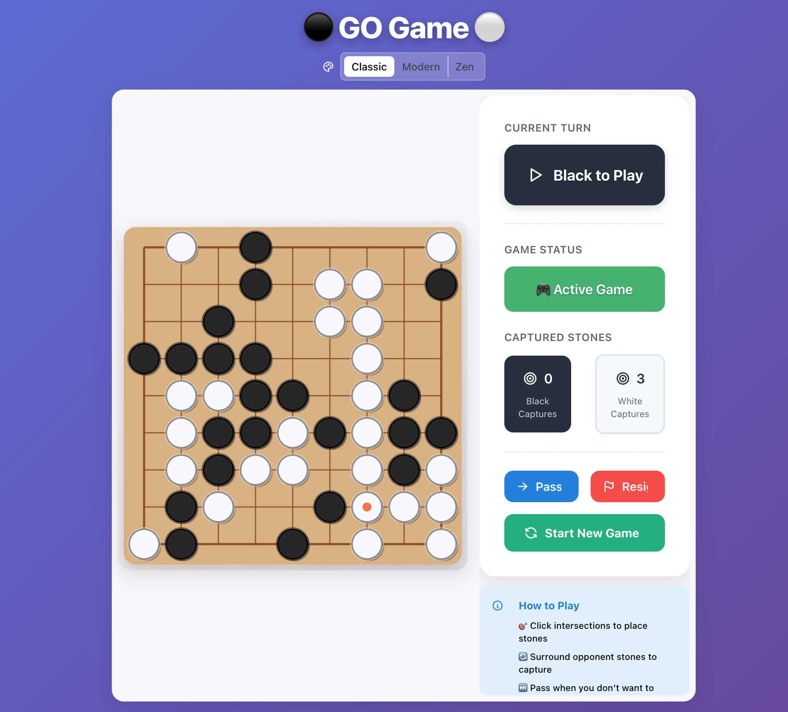

# GoGame



A modern, web-based Go (Weiqi/Baduk) game built with React and Nx monorepo architecture. Features a clean, intuitive interface with real-time multiplayer support, multiple themes, and comprehensive game functionality including stone placement, captures, scoring, and game state management.

## Features

### Core Gameplay
- 🎯 Interactive Go board with click-to-place stone mechanics
- 🎮 Multiple board sizes (9x9, 13x13, 19x19)
- 📊 Real-time game status and capture tracking
- ⚖️ Full scoring phase with dead stone marking
- 🔄 Pass and resignation options
- 🎌 Japanese rules implementation

### Multiplayer
- 🌐 Real-time online multiplayer via PartyKit
- 🏠 Create and join game rooms
- 👥 Player roles (Black, White, Spectator)
- 🔗 Share room IDs or join via URL
- ⚡ WebSocket-based real-time synchronization
- 🛡️ Server-side move validation

### Visual & UX
- 🎨 Multiple visual themes (Classic, Modern, Zen)
- 📱 Responsive design for various screen sizes
- 🔔 Visual feedback for moves and game events
- 📝 Move history and game state tracking

<a alt="Nx logo" href="https://nx.dev" target="_blank" rel="noreferrer"></a>

✨ Built with [Nx workspace](https://nx.dev) for optimal development experience ✨.

[Learn more about this workspace setup and its capabilities](https://nx.dev/getting-started/tutorials/react-monorepo-tutorial?utm_source=nx_project&utm_medium=readme&utm_campaign=nx_projects) or run `npx nx graph` to visually explore what was created. Now, let's get you up to speed!

## Finish your CI setup

[Click here to finish setting up your workspace!](https://cloud.nx.app/connect/FNRxlKHzdO)

## Quick Start

### Single Player Mode

1. Start the development server:
```sh
npx nx serve go-game
```

2. Open http://localhost:4200 in your browser

### Multiplayer Mode

1. Start the PartyKit server:
```sh
cd apps/go-game-partykit
npx partykit dev
```

2. In another terminal, start the frontend:
```sh
npx nx serve go-game
```

3. Open http://localhost:4200 and click "Switch to Multiplayer"

### Production Build

To create a production bundle:

```sh
npx nx build go-game
```

### API Backend (Optional)

The project includes a Node.js/Express backend with MongoDB for user authentication and game persistence:

```sh
# Start the API server
npx nx serve go-game-api

# MongoDB required for full functionality
# Set MONGODB_URI in environment variables
```

These targets are either [inferred automatically](https://nx.dev/concepts/inferred-tasks?utm_source=nx_project&utm_medium=readme&utm_campaign=nx_projects) or defined in the `project.json` or `package.json` files.

[More about running tasks in the docs &raquo;](https://nx.dev/features/run-tasks?utm_source=nx_project&utm_medium=readme&utm_campaign=nx_projects)

## Architecture

### Monorepo Structure

```
go-game/
├── apps/
│   ├── go-game/              # Main React frontend application
│   ├── go-game-api/          # Node.js/Express backend API
│   ├── go-game-partykit/     # PartyKit multiplayer server
│   └── go-game-e2e/          # End-to-end tests
├── libs/
│   ├── game/                 # Core game engine and components
│   ├── shared/               # Shared utilities and types
│   │   ├── types/           # TypeScript type definitions
│   │   ├── constants/       # Game constants
│   │   ├── utils/           # Utility functions
│   │   └── partykit-protocol/ # Multiplayer protocol definitions
│   └── ui/                   # Reusable UI components
└── docs/                     # Documentation

```

### Technology Stack

- **Frontend**: React 18, TypeScript, Mantine UI, RSpack
- **Multiplayer**: PartyKit (WebSocket), Edge-deployed
- **Backend API**: Node.js, Express, MongoDB, JWT
- **Monorepo**: Nx workspace
- **Styling**: SCSS modules, Mantine components
- **Testing**: Jest, Playwright
- **Deployment**: GitHub Pages (frontend), Cloudflare (PartyKit)

## Current Implementation Status

### ✅ Completed Features

#### Phase 1: Foundation MVP
- ✅ Core game engine with full Go rules
- ✅ Board sizes: 9x9, 13x13, 19x19
- ✅ Stone placement and capture detection
- ✅ Ko rule enforcement
- ✅ Suicide prevention
- ✅ Pass and resignation
- ✅ Multiple visual themes
- ✅ Responsive UI design
- ✅ Scoring phase with dead stone marking
- ✅ Japanese scoring rules

#### Phase 2: Multiplayer
- ✅ Real-time multiplayer via PartyKit
- ✅ Room creation and joining
- ✅ Player role assignment
- ✅ Move synchronization
- ✅ Server-side validation
- ✅ Spectator mode
- ✅ Connection status indicators
- ✅ URL-based room joining

#### Backend Infrastructure
- ✅ User authentication (JWT)
- ✅ User registration and login
- ✅ MongoDB integration
- ✅ Game model schema
- ✅ Error handling middleware
- ✅ Environment configuration

### 🚧 In Progress
- Game persistence to MongoDB
- User profiles and statistics
- Game history retrieval

### 📋 Planned Features
- ELO rating system
- Matchmaking
- Tournament support
- Chat functionality
- AI opponent
- Mobile app (PWA/Capacitor)
- Game replay system
- Time controls
- Teaching/tutorial mode

## Add new projects

While you could add new projects to your workspace manually, you might want to leverage [Nx plugins](https://nx.dev/concepts/nx-plugins?utm_source=nx_project&utm_medium=readme&utm_campaign=nx_projects) and their [code generation](https://nx.dev/features/generate-code?utm_source=nx_project&utm_medium=readme&utm_campaign=nx_projects) feature.

Use the plugin's generator to create new projects.

To generate a new application, use:

```sh
npx nx g @nx/react:app demo
```

To generate a new library, use:

```sh
npx nx g @nx/react:lib mylib
```

You can use `npx nx list` to get a list of installed plugins. Then, run `npx nx list <plugin-name>` to learn about more specific capabilities of a particular plugin. Alternatively, [install Nx Console](https://nx.dev/getting-started/editor-setup?utm_source=nx_project&utm_medium=readme&utm_campaign=nx_projects) to browse plugins and generators in your IDE.

[Learn more about Nx plugins &raquo;](https://nx.dev/concepts/nx-plugins?utm_source=nx_project&utm_medium=readme&utm_campaign=nx_projects) | [Browse the plugin registry &raquo;](https://nx.dev/plugin-registry?utm_source=nx_project&utm_medium=readme&utm_campaign=nx_projects)

[Learn more about Nx on CI](https://nx.dev/ci/intro/ci-with-nx#ready-get-started-with-your-provider?utm_source=nx_project&utm_medium=readme&utm_campaign=nx_projects)

## Install Nx Console

Nx Console is an editor extension that enriches your developer experience. It lets you run tasks, generate code, and improves code autocompletion in your IDE. It is available for VSCode and IntelliJ.

[Install Nx Console &raquo;](https://nx.dev/getting-started/editor-setup?utm_source=nx_project&utm_medium=readme&utm_campaign=nx_projects)

## Configuration

### Environment Variables

#### Backend API (go-game-api)
```bash
# .env file in apps/go-game-api/
PORT=8080
MONGODB_URI=mongodb://localhost:27017/go-game
JWT_SECRET=your-secret-key
NODE_ENV=development
```

#### PartyKit Server
```bash
# No configuration needed for local development
# Deployed automatically to Cloudflare edge network
```

### Deployment

#### Frontend (GitHub Pages)
The project includes a GitHub Actions workflow for automatic deployment:

```bash
# Manual deployment
npx nx build go-game
# Deploy dist/apps/go-game to your hosting service
```

#### PartyKit Server (Cloudflare)
```bash
cd apps/go-game-partykit
npx partykit deploy
```

#### Backend API
Can be deployed to any Node.js hosting service (Heroku, Railway, Render, etc.):
- Ensure MongoDB connection is configured
- Set environment variables
- Run `npm run build` and start with `node dist/apps/go-game-api/main.js`

## Development Guidelines

### Code Style
- TypeScript strict mode enabled
- ESLint and Prettier configured
- Component-based architecture
- Separation of concerns (game logic, UI, networking)

### Testing
```bash
# Run unit tests
npx nx test go-game

# Run e2e tests
npx nx e2e go-game-e2e

# Test specific library
npx nx test game
```

### Project Commands
```bash
# Generate new library
npx nx g @nx/react:lib my-lib

# Generate new component
npx nx g @nx/react:component my-component --project=game

# Check project graph
npx nx graph

# Run affected tests
npx nx affected:test

# Format code
npx nx format:write
```

## Contributing

1. Fork the repository
2. Create a feature branch (`git checkout -b feature/amazing-feature`)
3. Commit your changes (`git commit -m 'Add amazing feature'`)
4. Push to the branch (`git push origin feature/amazing-feature`)
5. Open a Pull Request

## License

This project is open source and available under the MIT License.

## Useful links

Learn more:

- [Learn more about this workspace setup](https://nx.dev/getting-started/tutorials/react-monorepo-tutorial?utm_source=nx_project&utm_medium=readme&utm_campaign=nx_projects)
- [Learn about Nx on CI](https://nx.dev/ci/intro/ci-with-nx?utm_source=nx_project&utm_medium=readme&utm_campaign=nx_projects)
- [Releasing Packages with Nx release](https://nx.dev/features/manage-releases?utm_source=nx_project&utm_medium=readme&utm_campaign=nx_projects)
- [What are Nx plugins?](https://nx.dev/concepts/nx-plugins?utm_source=nx_project&utm_medium=readme&utm_campaign=nx_projects)

And join the Nx community:

- [Discord](https://go.nx.dev/community)
- [Follow us on X](https://twitter.com/nxdevtools) or [LinkedIn](https://www.linkedin.com/company/nrwl)
- [Our Youtube channel](https://www.youtube.com/@nxdevtools)
- [Our blog](https://nx.dev/blog?utm_source=nx_project&utm_medium=readme&utm_campaign=nx_projects)
