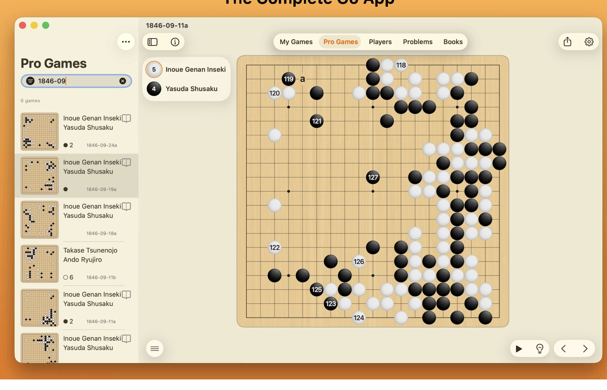

# Product Spec & Considerations

Forward-looking product direction for Go Game. This captures **where we want to
take the product** and **reference apps we admire**, as considerations — not all
of it is committed. For *how the system is built today* see
[`ARCHITECTURE.md`](ARCHITECTURE.md); for *deploy/launch tasks* see
[`PRODUCTION_READINESS.md`](PRODUCTION_READINESS.md).

**Status legend:** ✅ decided · 🔭 consideration (not committed) · ❓ open question

---

## 1. Positioning

Go Game is **multiplayer-first** (real-time online play via PartyKit) — that's
our differentiator and current strength. The reference apps below are
single-player **study/analysis** tools. The direction is to keep multiplayer as
the core and **add a study layer** on top (replay, records, archive, analysis),
which is largely additive and doesn't conflict with multiplayer.

- ✅ **Direction:** keep multiplayer core, add a study layer (not a pivot to a
  pure analysis tool).
- ✅ **Mac support:** ship a desktop app via **Electron** (in addition to web,
  iOS, Android). One reference app ("The Complete Go App") is itself a native
  Mac app — this is the bar.

---

## 2. Reference apps (north-star considerations)

These are apps we want to learn from. Screenshots preserved in
[`docs/assets/references/`](docs/assets/references/).

### 2.1 SmartGo-style analysis client

A single-player study/analysis tool. Notable robustness:
- **Move list** with coordinates + move numbers; click any move to jump.
- **Move scrubber / timeline** along the bottom (jump across moves 66–108).
- **Analysis tools:** Position eval, **Hotspot** (influence/heat), **Score**
  estimate — available *mid-game*, not just at the end.
- Realistic board with **coordinates** (e.g. `L14`) and a current-point marker.
- Info architecture: Play · Settings · Archive · Help · Diagnostics · About.
- Captured-stone display + per-move navigation controls.

### 2.2 "The Complete Go App" (native Mac)

A native **macOS** study/library app. Notable robustness:
- Top-level sections: **My Games · Pro Games · Players · Problems · Books**.
- **Game archive** with board-thumbnail previews, player names, dates, move counts.
- **Pro game database** (e.g. historical games, searchable).
- **Replay controls** (autoplay, step nav) with numbered moves on the board.
- **Problems (tsumego)** and **Books** sections — learning content.
- **Players** database. Share + settings.
- Confirms the **native desktop (Mac)** target and a multi-section, library-style IA.

---

## 3. Feature considerations (study layer)

Derived from the reference apps. Ordered roughly by leverage; ❓ which to do
first is still open.

| # | Feature | Status | Notes / what we already have |
|---|---|---|---|
| 1 | **Move replay + navigation** | 🔭 | Step fwd/back + scrubber over a game's `moveHistory` (already captured by the engine). Highest-leverage, lowest cost. |
| 2 | **SGF import/export** | 🔭 | The universal Go format — interop with every other tool, and the basis for an archive/pro-game DB. |
| 3 | **Game archive / library UI** | 🔭 | Browse + replay saved games. Backend already persists finished games to Mongo; needs a browse/replay UI. |
| 4 | **Board coordinates + polish** | 🔭 | A–T / 1–19 labels, current-move marker, captured-stone counts. Cheap, high perceived quality. |
| 5 | **Info architecture** | 🔭 | Settings · Help · About (· Diagnostics) — matches both references. |
| 6 | **Analysis: score estimate mid-game** | 🔭 | Generalize existing end-game scoring to an on-demand estimate. |
| 7 | **Analysis: influence / "hotspot" map** | 🔭 | Influence heatmap overlay. New algorithm work. |
| 8 | **AI opponent** | 🔭 | Current local "AI" is a trivial stub. Real strength needs an engine (e.g. KataGo/GNU Go) — significant scope; likely a later phase. |
| 9 | **Problems / tsumego** | 🔭 | Learning content + a problem-solving mode. Content-heavy. |
| 10 | **Pro game collection** | 🔭 | Bundled/searchable historical games (depends on SGF import). |
| 11 | **Players database** | 🔭 | Player profiles/records — overlaps with our existing user/profile system. |
| 12 | **Books / learning content** | 🔭 | Content product; out of near-term scope. |

**Natural grouping / sequence (consideration):**
1. **Replay + coordinates + archive UI** (reuse existing `moveHistory` + persisted games) → biggest study value, least new infra.
2. **SGF import/export** → unlocks pro-game collections and external interop.
3. **Analysis** (score estimate → influence) → depth.
4. **AI / problems / books** → larger, later phases.

---

## 4. Platform targets

| Platform | Status | Mechanism |
|---|---|---|
| Web | ✅ exists | React + RSpack, GitHub Pages |
| iOS | ✅ shell exists | Capacitor |
| Android | ✅ shell exists | Capacitor |
| **macOS desktop** | ✅ decided | **Electron** (wraps the web build; reuses the same React app) |

Electron notes (consideration for implementation):
- Reuse the existing `nx build go-game` web bundle as the renderer.
- Needs a main process, packaging (e.g. electron-builder), and code signing /
  notarization for distribution outside the Mac App Store.
- Offline-friendly: single-player + study features work without network; only
  multiplayer/auth/leaderboard need connectivity.

---

## 5. Open questions

- ❓ **First study feature** to build (Replay nav · SGF · Archive UI · Coordinates+polish).
- ❓ **Electron distribution**: direct download (notarized `.dmg`) vs Mac App Store.
- ❓ **AI opponent** ambition: keep a simple heuristic vs integrate a real engine.
- ❓ Whether **Players/Books** belong in scope at all (may be out of product focus).

---

*This is a living considerations doc — features here are candidates, not
commitments, until promoted into `PRODUCTION_READINESS.md` or a sprint plan.*
