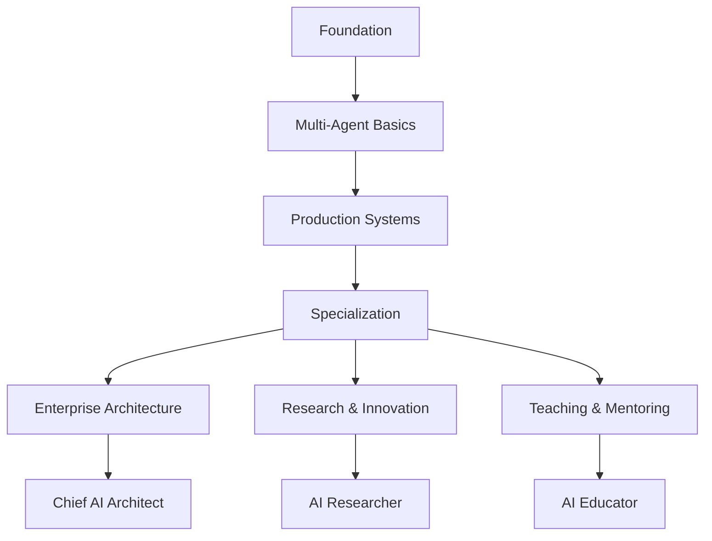

# 🚀 AI Multi-Agent Engineering Mastery Program
## The Complete Guide to Building Production-Ready Agent Systems with TypeScript

### 🎯 Program Mission

Transform from an AI enthusiast into a proficient multi-agent systems engineer capable of designing, building, and deploying sophisticated autonomous agent architectures that solve real-world business problems.

### 🧠 Core Learning Philosophy

**"Learn by Building, Master by Doing"**

This program follows a progressive complexity model where each concept builds upon the previous, using real-world analogies, hands-on coding, and production-grade patterns. Think of it like learning to cook - you start with basic knife skills, then simple recipes, and eventually orchestrate a full multi-course meal service.

---

## 📚 Table of Contents

1. [Program Overview](#program-overview)
2. [Prerequisites & Mental Models](#prerequisites--mental-models)
3. [Core Concepts & Analogies](#core-concepts--analogies)
4. [The Agent Ecosystem](#the-agent-ecosystem)
5. [11-Phase Learning Journey](#11-phase-learning-journey)
6. [Real-World Case Study](#real-world-case-study)
7. [Assessment Criteria](#assessment-criteria)
8. [Beyond the Basics](#beyond-the-basics)
9. [Resources & Community](#resources--community)

---

## 📋 Program Overview

### Duration & Commitment
- **Total Duration**: 8-12 weeks (flexible pace)
- **Weekly Commitment**: 10-15 hours
- **Hands-on Coding**: 70%
- **Theory & Reading**: 20%
- **Debugging & Optimization**: 10%

### What You'll Build

By the end of this program, you'll have built:

1. **A Complete Multi-Agent System** featuring:
   - 🔍 **Research Agent**: RAG-powered information gatherer
   - ✍️ **Writer Agent**: Content synthesizer and formatter
   - 🎯 **Critic Agent**: Quality assurance and improvement suggester
   - 🎛️ **Supervisor Agent**: Orchestrator and task delegator
   - 📊 **Analyst Agent**: Data processor and insights generator

2. **Production-Ready Features**:
   - Vector-based knowledge retrieval (RAG)
   - Multi-tier memory systems
   - Error handling and retry mechanisms
   - Comprehensive observability and tracing
   - Performance evaluation frameworks
   - CLI and API interfaces

3. **Real-World Applications**:
   - Product research automation
   - Technical documentation generation
   - Code review and analysis
   - Customer support automation
   - Data analysis pipelines

### Success Metrics

You'll know you've mastered the content when you can:
- ✅ Design agent architectures for novel problems
- ✅ Debug complex multi-agent interactions
- ✅ Optimize for cost, speed, and quality
- ✅ Implement production-grade error handling
- ✅ Build custom tools and integrations
- ✅ Evaluate and improve agent performance systematically

---

## 🧩 Prerequisites & Mental Models

### Technical Prerequisites

```typescript
// You should be comfortable with:
interface Prerequisites {
  typescript: {
    level: 'intermediate',
    concepts: ['async/await', 'types', 'classes', 'decorators']
  };
  nodejs: {
    version: '>=20.0.0',
    experience: 'basic file I/O, npm/yarn'
  };
  git: 'basic version control';
  api: 'REST API consumption';
  debugging: 'console.log to breakpoints';
}
```

### Mental Models to Develop

#### 1. The Restaurant Kitchen Analogy 🍳

Think of a multi-agent system like a professional kitchen:

- **Head Chef (Supervisor)**: Coordinates the entire operation, delegates tasks
- **Sous Chef (Research Agent)**: Gathers ingredients and recipes
- **Line Cooks (Specialized Agents)**: Execute specific tasks
- **Expeditor (Output Agent)**: Quality checks and final presentation
- **Kitchen Display System (State Management)**: Tracks all orders and progress

```typescript
// Mental model in code
class KitchenBrigade {
  supervisor = new HeadChef();
  agents = {
    prep: new PrepCook(),
    grill: new GrillCook(),
    sauce: new Saucier(),
    plating: new Expeditor()
  };
  
  async executeOrder(order: CustomerOrder) {
    const tasks = this.supervisor.decompose(order);
    const results = await this.orchestrate(tasks);
    return this.expeditor.finalize(results);
  }
}
```

#### 2. The Jazz Band Improvisation Model 🎺

Agents work like jazz musicians:
- Each has a specialty (instrument/role)
- They follow a general structure (chord progression/workflow)
- They improvise within constraints (prompts/tools)
- They listen and respond to each other (state sharing)

#### 3. The Corporate Team Model 👔

- **CEO (Main Application)**: Sets vision and goals
- **Directors (Supervisors)**: Break down strategic objectives
- **Managers (Orchestrators)**: Coordinate team efforts
- **Individual Contributors (Agents)**: Execute specific tasks
- **Shared Drive (State/Memory)**: Common knowledge base

---

## 🌟 Core Concepts & Analogies

### 1. Agents: The Autonomous Workers

**Definition**: An agent is an LLM-powered entity that can perceive its environment, make decisions, and take actions to achieve specific goals.

**Analogy**: Think of an agent like a smart assistant with:
- **Eyes** (input processing): Can read and understand information
- **Brain** (LLM + prompt): Makes decisions based on instructions
- **Hands** (tools/functions): Can perform actions
- **Memory** (context/state): Remembers important information
- **Voice** (output): Communicates results

```typescript
// Conceptual Agent Anatomy
class Agent {
  // The "personality" and expertise
  private systemPrompt: string;
  
  // The "brain" - decision maker
  private llm: ChatOpenAI;
  
  // The "hands" - what it can do
  private tools: Tool[];
  
  // The "memory" - what it knows
  private context: AgentMemory;
  
  // The "nervous system" - how it processes
  async think(input: string): Promise<Thought> {
    return this.llm.process(this.systemPrompt, input, this.context);
  }
  
  // The "reflexes" - automated responses
  async act(thought: Thought): Promise<Action> {
    return this.executeTools(thought.selectedTools);
  }
}
```

### 2. Tools & Function Calling: The Agent's Toolkit

**Definition**: Tools are structured functions that agents can invoke to interact with external systems or perform computations.

**Analogy**: Like a Swiss Army knife 🔧:
- Each tool has a specific purpose
- Tools have defined inputs/outputs
- Agents choose the right tool for the job
- Multiple tools can be combined

```typescript
// Tool Design Patterns
const toolPatterns = {
  // Information Retrieval Tool
  search: {
    pattern: 'QUERY → SEARCH → FILTER → RETURN',
    example: 'googleSearchTool',
    useCase: 'When agent needs external information'
  },
  
  // Computation Tool  
  calculate: {
    pattern: 'INPUT → VALIDATE → COMPUTE → FORMAT',
    example: 'mathematicsTool',
    useCase: 'When agent needs precise calculations'
  },
  
  // Integration Tool
  api: {
    pattern: 'REQUEST → AUTH → CALL → PARSE',
    example: 'slackPostTool',
    useCase: 'When agent needs to interact with external services'
  },
  
  // Transformation Tool
  format: {
    pattern: 'DATA → SCHEMA → TRANSFORM → OUTPUT',
    example: 'jsonToMarkdownTool',
    useCase: 'When agent needs to restructure data'
  }
};
```

### 3. RAG (Retrieval-Augmented Generation): The Knowledge Library

**Definition**: RAG enhances LLM responses by retrieving relevant information from a knowledge base before generating answers.

**Analogy**: Like a lawyer preparing for a case 📚:
1. **Research Phase**: Search through case files (vector search)
2. **Evidence Collection**: Gather relevant documents (retrieval)
3. **Citation**: Reference specific sources (metadata)
4. **Argument Construction**: Build response with evidence (generation)

```typescript
// RAG Pipeline Visualization
class RAGPipeline {
  // Step 1: The Librarian - Organize knowledge
  async index(documents: Document[]): Promise<VectorStore> {
    const chunks = this.splitIntoChunks(documents);
    const embeddings = await this.embed(chunks);
    return this.store(embeddings);
  }
  
  // Step 2: The Researcher - Find relevant info
  async retrieve(query: string, k: number = 5): Promise<Chunk[]> {
    const queryEmbedding = await this.embed(query);
    const similar = this.vectorStore.search(queryEmbedding, k);
    return this.rerank(similar, query); // Optional reranking
  }
  
  // Step 3: The Scholar - Generate grounded response
  async generate(query: string, context: Chunk[]): Promise<string> {
    const prompt = this.buildPrompt(query, context);
    const response = await this.llm.invoke(prompt);
    return this.addCitations(response, context);
  }
}
```

### 4. Orchestration: The Conductor's Baton

**Definition**: Orchestration is the coordination of multiple agents to achieve complex goals through planned interactions.

**Analogy**: Like conducting an orchestra 🎼:
- **Score (Workflow)**: The predetermined sequence of operations
- **Conductor (Supervisor)**: Decides who plays when
- **Musicians (Agents)**: Execute their parts
- **Harmony (State)**: Shared context that keeps everyone synchronized

```typescript
// Orchestration Patterns
enum OrchestrationPattern {
  // Sequential: Like a relay race
  SEQUENTIAL = "A → B → C → Done",
  
  // Parallel: Like a cooking competition
  PARALLEL = "A + B + C → Merge → Done",
  
  // Hierarchical: Like a corporate structure
  HIERARCHICAL = "Boss → (Worker1, Worker2) → Boss → Done",
  
  // Mesh: Like a brainstorming session
  MESH = "All agents communicate with all others",
  
  // Pipeline: Like an assembly line
  PIPELINE = "Raw → Process1 → Process2 → QA → Ship"
}

// Real Implementation Example
class OrchestratorExample {
  async executeWorkflow(task: ComplexTask) {
    // Decompose like breaking down a recipe
    const subtasks = this.supervisor.decompose(task);
    
    // Execute like cooking multiple dishes
    const results = await Promise.all(
      subtasks.map(st => this.assignToAgent(st))
    );
    
    // Combine like plating the final dish
    return this.supervisor.synthesize(results);
  }
}
```

### 5. Memory Systems: The Agent's Journal

**Definition**: Memory systems allow agents to retain and retrieve information across interactions.

**Types of Memory**:

```typescript
interface MemoryTypes {
  // Like short-term human memory (7±2 items)
  shortTerm: {
    scope: 'current conversation',
    duration: 'session',
    example: 'last 5 messages in chat',
    implementation: 'array buffer'
  };
  
  // Like taking notes in a meeting
  episodic: {
    scope: 'specific interactions',
    duration: 'medium-term',
    example: 'previous customer interactions',
    implementation: 'database with timestamps'
  };
  
  // Like learned skills and knowledge
  semantic: {
    scope: 'facts and concepts',
    duration: 'permanent',
    example: 'product documentation',
    implementation: 'vector database'
  };
  
  // Like muscle memory
  procedural: {
    scope: 'how to do things',
    duration: 'permanent',
    example: 'workflow patterns',
    implementation: 'coded behaviors'
  };
}
```

---

## 🎭 The Agent Ecosystem

### Agent Taxonomy

```typescript
// The Agent Family Tree
interface AgentTypes {
  // The Thinkers - Analysis and Planning
  cognitive: {
    researcher: 'Gathers and synthesizes information',
    analyst: 'Processes data and finds patterns',
    strategist: 'Plans multi-step approaches',
    critic: 'Evaluates quality and identifies issues'
  };
  
  // The Doers - Execution and Creation
  executive: {
    writer: 'Creates content and documentation',
    coder: 'Writes and reviews code',
    designer: 'Creates visual and structural designs',
    builder: 'Constructs solutions from components'
  };
  
  // The Connectors - Integration and Communication
  interface: {
    translator: 'Converts between formats/languages',
    messenger: 'Handles communication channels',
    integrator: 'Connects with external systems',
    formatter: 'Ensures output standards'
  };
  
  // The Guardians - Safety and Quality
  protective: {
    validator: 'Ensures data correctness',
    moderator: 'Filters inappropriate content',
    auditor: 'Tracks compliance and regulations',
    security: 'Identifies vulnerabilities'
  };
  
  // The Coordinators - Management and Orchestration
  managerial: {
    supervisor: 'Delegates and monitors tasks',
    router: 'Directs requests to specialists',
    scheduler: 'Manages time and resources',
    aggregator: 'Combines multiple outputs'
  };
}
```

### Communication Patterns

```typescript
// How Agents Talk to Each Other
class AgentCommunication {
  // Direct Message: Like email
  async directMessage(from: Agent, to: Agent, message: Message) {
    return to.receive(from.send(message));
  }
  
  // Broadcast: Like a company announcement
  async broadcast(sender: Agent, message: Message) {
    return Promise.all(
      this.allAgents.map(agent => agent.receive(message))
    );
  }
  
  // Request-Response: Like a help desk ticket
  async requestResponse(requester: Agent, responder: Agent, query: Query) {
    const ticket = requester.createRequest(query);
    const response = await responder.process(ticket);
    return requester.handleResponse(response);
  }
  
  // Pub-Sub: Like a newsletter subscription
  async publishSubscribe(publisher: Agent, event: Event) {
    const subscribers = this.getSubscribers(event.type);
    return Promise.all(
      subscribers.map(sub => sub.handleEvent(event))
    );
  }
  
  // Consensus: Like a team vote
  async consensus(agents: Agent[], proposal: Proposal) {
    const votes = await Promise.all(
      agents.map(a => a.evaluate(proposal))
    );
    return this.tallyVotes(votes);
  }
}
```

---

## 📖 11-Phase Learning Journey

### Phase Structure

Each phase follows this pattern:
1. **Conceptual Foundation**: Understanding the "why"
2. **Hands-on Implementation**: Building the "what"
3. **Real-world Application**: Applying the "how"
4. **Debugging & Optimization**: Perfecting the craft
5. **Assessment & Reflection**: Validating mastery

### 🎯 Phase 1: Setup and Foundations (Week 1)
**Mission**: Build your AI agent development environment and create your first LLM-powered tool

**Learning Outcomes**:
- Configure a production-grade TypeScript project
- Understand LLM interaction patterns
- Master function calling and tool creation
- Set up comprehensive observability

**Key Concepts**:
- Environment configuration
- API key management
- Tracing and debugging
- Tool schemas with Zod
- Error handling patterns

**Hands-on Labs**:
1. **Lab 1.1**: Environment Setup Mastery
2. **Lab 1.2**: First LLM Conversation
3. **Lab 1.3**: Building Custom Tools
4. **Lab 1.4**: Advanced Function Calling
5. **Lab 1.5**: Tracing and Debugging

**Deliverables**:
- Working development environment
- 5+ custom tools with tests
- Traced conversations in LangSmith
- Error handling utilities

### 🔍 Phase 2: RAG and Vector Stores (Week 2)
**Mission**: Build a knowledge-powered agent that can access and cite information

**Learning Outcomes**:
- Implement document ingestion pipelines
- Master embedding strategies
- Build efficient retrieval systems
- Create citation mechanisms

**Key Concepts**:
- Vector embeddings
- Similarity search
- Chunking strategies
- Metadata management
- Reranking algorithms

**Hands-on Labs**:
1. **Lab 2.1**: Document Processing Pipeline
2. **Lab 2.2**: Embedding Strategies Comparison
3. **Lab 2.3**: Building Vector Stores
4. **Lab 2.4**: Advanced Retrieval Techniques
5. **Lab 2.5**: Citation and Source Management

**Deliverables**:
- Multi-format document ingestion
- Optimized vector store
- RAG pipeline with citations
- Performance benchmarks

### 🤖 Phase 3: Building Specialized Agents (Week 3)
**Mission**: Create a team of specialized agents with distinct capabilities

**Learning Outcomes**:
- Design agent personalities and roles
- Implement specialized toolsets
- Create agent interaction protocols
- Build quality assurance mechanisms

**Key Concepts**:
- Prompt engineering
- Role-based design
- Tool specialization
- Output validation
- Agent evaluation

**Hands-on Labs**:
1. **Lab 3.1**: Research Agent Development
2. **Lab 3.2**: Writer Agent Creation
3. **Lab 3.3**: Critic Agent Implementation
4. **Lab 3.4**: Custom Agent Builder
5. **Lab 3.5**: Agent Testing Framework

**Deliverables**:
- 5+ specialized agents
- Agent interaction protocols
- Quality metrics dashboard
- Test suite with coverage

### 🎼 Phase 4: Orchestration with LangGraph (Week 4)
**Mission**: Build sophisticated multi-agent workflows with state management

**Learning Outcomes**:
- Master graph-based orchestration
- Implement complex routing logic
- Build state management systems
- Create conditional workflows

**Key Concepts**:
- Graph theory for agents
- State machines
- Routing algorithms
- Parallel execution
- Workflow patterns

**Hands-on Labs**:
1. **Lab 4.1**: Graph Fundamentals
2. **Lab 4.2**: Building State Machines
3. **Lab 4.3**: Conditional Routing
4. **Lab 4.4**: Parallel Agent Execution
5. **Lab 4.5**: Complex Workflow Patterns

**Deliverables**:
- Multi-agent graph system
- Dynamic routing implementation
- State persistence layer
- Workflow visualization

### 🧠 Phase 5: Memory Systems (Week 5)
**Mission**: Implement sophisticated memory systems for context retention

**Learning Outcomes**:
- Build multi-tier memory architectures
- Implement memory retrieval strategies
- Create memory compression techniques
- Design memory lifecycle management

**Key Concepts**:
- Memory hierarchies
- Context windows
- Memory summarization
- Semantic memory
- Memory decay

**Hands-on Labs**:
1. **Lab 5.1**: Short-term Memory Buffer
2. **Lab 5.2**: Long-term Memory Store
3. **Lab 5.3**: Episodic Memory System
4. **Lab 5.4**: Memory Compression
5. **Lab 5.5**: Cross-agent Memory Sharing

**Deliverables**:
- Multi-tier memory system
- Memory management utilities
- Compression algorithms
- Performance analysis

### 🛡️ Phase 6: Guardrails and Reliability (Week 6)
**Mission**: Build production-grade reliability into your agent system

**Learning Outcomes**:
- Implement comprehensive error handling
- Build retry mechanisms
- Create validation systems
- Design fallback strategies

**Key Concepts**:
- Circuit breakers
- Exponential backoff
- Input validation
- Output sanitization
- Graceful degradation

**Hands-on Labs**:
1. **Lab 6.1**: Error Handling Patterns
2. **Lab 6.2**: Retry Mechanisms
3. **Lab 6.3**: Validation Frameworks
4. **Lab 6.4**: Circuit Breakers
5. **Lab 6.5**: Fallback Strategies

**Deliverables**:
- Error handling framework
- Retry system with backoff
- Validation middleware
- Monitoring dashboard

### 📊 Phase 7: Evaluation with LangSmith (Week 7)
**Mission**: Build comprehensive evaluation systems for agent quality

**Learning Outcomes**:
- Design evaluation metrics
- Implement automated testing
- Build regression detection
- Create performance benchmarks

**Key Concepts**:
- Evaluation metrics
- A/B testing
- Regression testing
- Performance profiling
- Quality scoring

**Hands-on Labs**:
1. **Lab 7.1**: Metric Design
2. **Lab 7.2**: Automated Evaluation
3. **Lab 7.3**: A/B Testing Framework
4. **Lab 7.4**: Regression Detection
5. **Lab 7.5**: Performance Profiling

**Deliverables**:
- Evaluation framework
- Automated test suite
- Performance benchmarks
- Quality dashboard

### 🔬 Phase 8: Advanced RAG Optimization (Week 8)
**Mission**: Optimize retrieval quality for production workloads

**Learning Outcomes**:
- Implement advanced chunking strategies
- Build query optimization systems
- Create hybrid search mechanisms
- Design reranking algorithms

**Key Concepts**:
- Semantic chunking
- Query expansion
- Hybrid search
- Cross-encoder reranking
- Relevance feedback

**Hands-on Labs**:
1. **Lab 8.1**: Advanced Chunking
2. **Lab 8.2**: Query Optimization
3. **Lab 8.3**: Hybrid Search
4. **Lab 8.4**: Reranking Systems
5. **Lab 8.5**: Feedback Loops

**Deliverables**:
- Optimized RAG pipeline
- Query enhancement system
- Hybrid search implementation
- Performance improvements

### 🔍 Phase 9: Observability and Tracing (Week 9)
**Mission**: Build comprehensive observability into your agent system

**Learning Outcomes**:
- Implement distributed tracing
- Build logging systems
- Create monitoring dashboards
- Design alerting mechanisms

**Key Concepts**:
- Distributed tracing
- Structured logging
- Metrics collection
- Dashboard design
- Alert management

**Hands-on Labs**:
1. **Lab 9.1**: Tracing Implementation
2. **Lab 9.2**: Structured Logging
3. **Lab 9.3**: Metrics Collection
4. **Lab 9.4**: Dashboard Creation
5. **Lab 9.5**: Alert Configuration

**Deliverables**:
- Tracing system
- Logging framework
- Monitoring dashboard
- Alert configurations

### 🌐 Phase 10: External Integrations (Week 10)
**Mission**: Connect your agents to the outside world

**Learning Outcomes**:
- Integrate external databases
- Implement web search capabilities
- Build API integrations
- Create webhook handlers

**Key Concepts**:
- Database connections
- Web search APIs
- REST/GraphQL integration
- Webhook processing
- Authentication patterns

**Hands-on Labs**:
1. **Lab 10.1**: Database Integration
2. **Lab 10.2**: Web Search Implementation
3. **Lab 10.3**: API Connections
4. **Lab 10.4**: Webhook Handlers
5. **Lab 10.5**: Authentication Systems

**Deliverables**:
- Database connectors
- Search integration
- API client library
- Webhook system

### 🚀 Phase 11: Production Deployment (Week 11)
**Mission**: Deploy your multi-agent system to production

**Learning Outcomes**:
- Build production CLI interfaces
- Create API endpoints
- Implement deployment pipelines
- Design scaling strategies

**Key Concepts**:
- CLI design
- API architecture
- CI/CD pipelines
- Container orchestration
- Load balancing

**Hands-on Labs**:
1. **Lab 11.1**: CLI Development
2. **Lab 11.2**: API Creation
3. **Lab 11.3**: Docker Containerization
4. **Lab 11.4**: CI/CD Pipeline
5. **Lab 11.5**: Production Monitoring

**Deliverables**:
- Production CLI
- REST API
- Docker containers
- Deployment pipeline

---

## 🏗️ Real-World Case Study: Building "ResearchBot Pro"

### Project Overview

Throughout the program, you'll build "ResearchBot Pro" - a production-grade multi-agent system for automated market research and competitive analysis.

### System Architecture

```typescript
// The Complete System
class ResearchBotPro {
  // The Brain Trust - Core Agents
  agents = {
    // Gathers raw intelligence
    dataCollector: new DataCollectorAgent({
      tools: ['webSearch', 'pdfExtractor', 'apiCrawler'],
      specialties: ['market data', 'competitor info', 'industry trends']
    }),
    
    // Analyzes and synthesizes
    analyst: new AnalystAgent({
      tools: ['dataProcessor', 'trendAnalyzer', 'compareMetrics'],
      specialties: ['SWOT analysis', 'market sizing', 'competitive positioning']
    }),
    
    // Creates deliverables
    reporter: new ReporterAgent({
      tools: ['documentBuilder', 'chartGenerator', 'formatter'],
      specialties: ['executive summaries', 'detailed reports', 'presentations']
    }),
    
    // Ensures quality
    qualityAssurance: new QAAgent({
      tools: ['factChecker', 'citationValidator', 'coherenceAnalyzer'],
      specialties: ['accuracy', 'completeness', 'clarity']
    }),
    
    // Manages everything
    projectManager: new SupervisorAgent({
      tools: ['taskDecomposer', 'resourceAllocator', 'progressTracker'],
      specialties: ['workflow optimization', 'deadline management', 'quality control']
    })
  };
  
  // The Knowledge Base
  knowledge = {
    vectorStore: new PineconeStore(),
    documentDB: new MongoDB(),
    cache: new RedisCache()
  };
  
  // The Workflow Engine
  orchestrator = new LangGraphOrchestrator({
    patterns: ['research', 'analysis', 'synthesis', 'review', 'delivery'],
    errorHandling: 'retry-with-backoff',
    monitoring: 'full-telemetry'
  });
}
```

### Progressive Implementation

**Week 1-2**: Basic Setup
- Single agent with web search
- Simple RAG over documents
- Basic CLI interface

**Week 3-4**: Multi-Agent Coordination
- Add specialized agents
- Implement supervisor
- Create state management

**Week 5-6**: Production Features
- Add memory systems
- Implement error handling
- Build evaluation framework

**Week 7-8**: Optimization
- Enhance RAG quality
- Add caching layers
- Implement monitoring

**Week 9-10**: External Integration
- Connect to APIs
- Add database storage
- Implement webhooks

**Week 11**: Production Launch
- Deploy to cloud
- Set up monitoring
- Create documentation

---

## 📈 Assessment Criteria

### Skill Progression Rubric

```typescript
interface SkillLevels {
  beginner: {
    knowledge: 'Understands concepts',
    implementation: 'Can follow tutorials',
    debugging: 'Uses console.log',
    example: 'Builds single agent with tools'
  };
  
  intermediate: {
    knowledge: 'Applies patterns',
    implementation: 'Modifies examples',
    debugging: 'Uses debugger and traces',
    example: 'Builds multi-agent with orchestration'
  };
  
  advanced: {
    knowledge: 'Creates solutions',
    implementation: 'Designs from scratch',
    debugging: 'Uses profiling and metrics',
    example: 'Builds production system with monitoring'
  };
  
  expert: {
    knowledge: 'Innovates patterns',
    implementation: 'Optimizes for scale',
    debugging: 'Predicts and prevents issues',
    example: 'Architects enterprise solutions'
  };
}
```

### Project Evaluation Criteria

Each project is evaluated on:

1. **Functionality (40%)**
   - Meets requirements
   - Handles edge cases
   - Provides value

2. **Code Quality (25%)**
   - Clean architecture
   - Proper abstractions
   - Documentation

3. **Performance (20%)**
   - Response time
   - Token efficiency
   - Resource usage

4. **Reliability (15%)**
   - Error handling
   - Retry logic
   - Graceful degradation

### Certification Levels

**🥉 Bronze Certification**: Complete Phases 1-4
- Build basic multi-agent systems
- Implement RAG pipelines
- Create simple orchestrations

**🥈 Silver Certification**: Complete Phases 1-8
- Design complex workflows
- Implement production features
- Optimize performance

**🥇 Gold Certification**: Complete all 11 Phases
- Architect enterprise solutions
- Deploy to production
- Mentor others

---

## 🚀 Beyond the Basics: Advanced Topics

### Advanced Patterns

```typescript
// 1. Self-Improving Agents
class SelfImprovingAgent extends BaseAgent {
  async improveFromFeedback(feedback: Feedback) {
    const analysis = await this.analyzeFeedback(feedback);
    const improvements = await this.generateImprovements(analysis);
    await this.updatePrompts(improvements);
    await this.retrain();
  }
}

// 2. Adversarial Agents
class AdversarialPair {
  generator = new GeneratorAgent();
  critic = new CriticAgent();
  
  async improve(iterations: number) {
    for (let i = 0; i < iterations; i++) {
      const output = await this.generator.create();
      const critique = await this.critic.evaluate(output);
      await this.generator.learn(critique);
    }
  }
}

// 3. Meta-Learning Agents
class MetaLearningAgent extends BaseAgent {
  async learnToLearn(tasks: Task[]) {
    const patterns = await this.extractPatterns(tasks);
    const strategies = await this.generateStrategies(patterns);
    await this.optimizeApproach(strategies);
  }
}

// 4. Swarm Intelligence
class SwarmSystem {
  agents: MicroAgent[] = [];
  
  async collectiveIntelligence(problem: Problem) {
    const solutions = await Promise.all(
      this.agents.map(a => a.propose(problem))
    );
    return this.emergentSolution(solutions);
  }
}
```

### Performance Optimization Techniques

```typescript
// 1. Caching Strategies
class CacheOptimizedAgent {
  private semanticCache = new SemanticCache();
  private resultCache = new LRUCache();
  
  async process(input: Input) {
    // Check semantic similarity cache
    const cached = await this.semanticCache.get(input);
    if (cached) return cached;
    
    // Process and cache
    const result = await this.llm.process(input);
    await this.semanticCache.set(input, result);
    return result;
  }
}

// 2. Batching and Streaming
class BatchProcessor {
  async processBatch(inputs: Input[]) {
    // Group similar inputs
    const groups = this.groupBySimilarity(inputs);
    
    // Process groups in parallel
    const results = await Promise.all(
      groups.map(g => this.processGroup(g))
    );
    
    // Stream results as they complete
    for await (const result of results) {
      yield result;
    }
  }
}

// 3. Token Optimization
class TokenOptimizer {
  async optimize(prompt: string, context: string) {
    // Compress context
    const compressed = await this.compress(context);
    
    // Trim to fit window
    const trimmed = this.trimToWindow(compressed);
    
    // Prioritize important info
    const prioritized = this.prioritizeContent(trimmed);
    
    return this.buildOptimizedPrompt(prompt, prioritized);
  }
}
```

### Scaling Strategies

```typescript
// 1. Horizontal Scaling
class ScalableAgentPool {
  private pool: Agent[] = [];
  private loadBalancer = new RoundRobinBalancer();
  
  async scale(factor: number) {
    const newAgents = await this.spawn(factor);
    this.pool.push(...newAgents);
  }
  
  async process(request: Request) {
    const agent = this.loadBalancer.next(this.pool);
    return agent.process(request);
  }
}

// 2. Distributed Processing
class DistributedOrchestrator {
  private nodes: ComputeNode[] = [];
  
  async distribute(workflow: Workflow) {
    const tasks = this.decompose(workflow);
    const assignments = this.optimize(tasks, this.nodes);
    return Promise.all(
      assignments.map(a => a.node.execute(a.task))
    );
  }
}

// 3. Edge Deployment
class EdgeAgent {
  private localModel: SmallLLM;
  private cloudFallback: CloudLLM;
  
  async process(input: Input) {
    try {
      // Try local first
      return await this.localModel.process(input);
    } catch (e) {
      // Fallback to cloud
      return await this.cloudFallback.process(input);
    }
  }
}
```

---

## 📚 Resources & Community

### Essential Reading

1. **Papers**
   - "Attention Is All You Need" - Transformer architecture
   - "Chain-of-Thought Prompting" - Reasoning techniques
   - "Constitutional AI" - Safety and alignment
   - "ReAct: Reasoning and Acting" - Agent foundations

2. **Books**
   - "Designing Data-Intensive Applications" - System design
   - "The Pragmatic Programmer" - Best practices
   - "Building LLM Apps" - Practical guide

3. **Courses**
   - DeepLearning.AI - LangChain courses
   - Fast.AI - Practical deep learning
   - Anthropic - Constitutional AI

### Tools & Frameworks

```typescript
const toolkit = {
  // Core Frameworks
  langchain: 'Agent building blocks',
  langgraph: 'Workflow orchestration',
  langsmith: 'Observability and evaluation',
  
  // LLM Providers
  openai: 'GPT models',
  anthropic: 'Claude models',
  googleAI: 'Gemini models',
  
  // Vector Databases
  pinecone: 'Managed vector DB',
  weaviate: 'Open-source vector DB',
  qdrant: 'High-performance vector DB',
  
  // Supporting Tools
  zod: 'Schema validation',
  prisma: 'Database ORM',
  bull: 'Queue management',
  
  // Monitoring
  sentry: 'Error tracking',
  datadog: 'APM and logging',
  grafana: 'Metrics visualization'
};
```

### Community & Support

1. **Discord Communities**
   - LangChain Discord
   - AI Engineers Discord
   - OpenAI Developer Forum

2. **GitHub Resources**
   - Awesome-LangChain
   - LangChain Examples
   - Community Templates

3. **Conferences & Meetups**
   - AI Engineer Summit
   - LLM Bootcamp
   - Local AI/ML Meetups

### Continuous Learning Path



---

## 🎓 Final Words of Wisdom

### The Journey Ahead

Building AI agents is both an art and a science. Like learning a musical instrument, you'll progress through stages:

1. **Conscious Incompetence**: You know what you don't know
2. **Conscious Competence**: You can do it with effort
3. **Unconscious Competence**: It becomes second nature
4. **Mastery**: You innovate and teach others

### Key Success Factors

1. **Consistency**: Code every day, even if just 30 minutes
2. **Curiosity**: Question everything, experiment constantly
3. **Community**: Share your learnings, help others
4. **Patience**: Complex systems take time to master
5. **Persistence**: Debug failures are learning opportunities

### Your First 100 Days

- **Days 1-30**: Foundation and basics
- **Days 31-60**: Building real systems
- **Days 61-90**: Optimization and scaling
- **Days 91-100**: Teaching and innovating

Remember: Every expert was once a beginner. The difference is they started and never stopped learning.

---

## 🏁 Ready to Begin?

Your journey to becoming an AI Multi-Agent Engineer starts now. Welcome to the future of software development, where you don't just write code - you orchestrate intelligence.

**Your first step**: Set up your development environment and make your first agent say "Hello, World!" - but make it cite its sources! 🚀

```typescript
// Your journey begins here
async function main() {
  console.log("🚀 Starting AI Agent Engineering Journey...");
  const agent = new LearningAgent();
  await agent.initialize();
  await agent.learn();
  await agent.build();
  await agent.ship();
  console.log("🎉 You are now an AI Agent Engineer!");
}

main().catch(console.error);
```

---

*"The best time to plant a tree was 20 years ago. The second best time is now."*
*- Chinese Proverb*

*Applied to AI: The best time to learn agent engineering was yesterday. The second best time is right now.*

Happy Building! 🏗️🤖✨